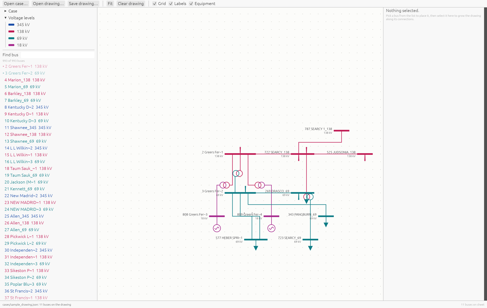

# pf-vis: Power Flow & One-Line Diagram Visualizer

`pf-vis` is a fast, lightweight native desktop application written in Rust for inspecting PSS/E power flow cases (`.RAW` files) and dynamically building vector one-line diagrams.

Built with [`egui`](https://github.com/emilk/egui) and [`eframe`](https://github.com/emilk/egui/tree/master/crates/eframe) (using the 2D `glow` OpenGL backend), `pf-vis` provides an infinite vector drawing sheet, orthogonal line routing, automatic grid placement, voltage color coding, and detailed element inspection—without heavy rendering dependencies.



> 📖 **Looking for step-by-step instructions? Check out the comprehensive [User Guide](USER_GUIDE.md) with visual walkthroughs.**

---


## Highlights & Features

* **PSS/E `.RAW` Parser**:
  * Parses PSS/E network models across file revisions (Revision 35 verified; Revisions 32–34 supported).
  * Decodes typed records for **Buses**, **Branches** (Transmission Lines), **Transformers** (2-winding & 3-winding, tap ratios, phase shifts), **Generators**, **Loads**, **Fixed Shunts**, and **Switched Shunts**.
  * Handles change cases (`IC = 1`), tracks dangling references, and reports unread sections without failing silently.
* **Interactive One-Line Canvas**:
  * **Incremental Network Building**: Search for any bus in the case, place it on the sheet, and expand ("grow") the diagram along incident lines and transformers.
  * **Snapping & Grid Layout**: Busbars snap to an underlying placement grid.
  * **Orthogonal Routing & Moving**: Transmission line routes and transformer winding symbols update dynamically. Drag lines and transformers to customize routes, adjust jogs, or clearly separate parallel circuits.
  * **Auto Route & Context Menu**: Right-click any bus to open the context menu and trigger **Auto route**, which automatically sizes the busbar to fit attached equipment and cleanly separates incident parallel circuits with symmetric orthogonal offsets to prevent overlapping.
  * **Smooth Pan & Zoom**: Pan by dragging canvas; zoom anchored to mouse cursor position; single-click auto-fit camera framing.
  * **Bus Orientation & Length**: Rotate busbars between horizontal and vertical orientations and manually resize busbar length via endpoint drag handles on the canvas or the inspector panel.
* **Detailed Element & Case Inspector**:
  * View bus properties: solved voltage magnitude (`Vm`), phase angle (`Va`), base kV, area, zone, and bus type (PV, PQ, Swing, Isolated).
  * Inspect branch parameters ($R$, $X$, $B$, Rating A) and transformer winding configurations (tap ratios, phase angles, ratings).
  * View connected equipment: active/reactive power ($P$/$Q$) for generators and loads, shunt Mvar values.
* **Voltage Level Color Coding**:
  * Automatic color mapping based on nominal bus voltages (e.g., 765 kV down to 4.16 kV).
  * Logarithmic ratio matching assigns consistent, distinct visual colors to non-standard voltage levels.
* **Project Persistence**:
  * Save and load diagram layouts as `.json` project files.
  * Preserves relative paths so drawings move cleanly alongside their underlying `.RAW` case files.
* **Headless CLI Summary**:
  * Inspect case statistics (buses, branches, transformers, MVA base, revision, comments) directly from the command line without launching the GUI.

---

## Project Structure

```
pf-vis/
├── cases/                  # Example PSS/E RAW power flow cases
│   └── MemphisCase2026_Mar7.RAW
├── src/
│   ├── main.rs             # CLI handling, summary mode, and window launch
│   ├── app.rs              # Main egui GUI application logic & UI panels
│   ├── model/              # Graph representation & element indexing
│   │   └── mod.rs
│   ├── psse/               # PSS/E raw file scanner & typed record parsing
│   │   ├── mod.rs
│   │   ├── raw.rs
│   │   └── scan.rs
│   └── diagram/            # Diagram state, grid layout, orthogonal routing, styling
│       ├── mod.rs
│       ├── layout.rs
│       ├── render.rs
│       └── style.rs
└── Cargo.toml
```

---

## Getting Started

### Prerequisites

* **Rust Toolchain**: 2024 edition (Rust 1.85+ recommended). Install via [rustup.rs](https://rustup.rs/).
* **Graphics**: An OpenGL 2.0+ capable graphics driver.

### Building & Running

#### 1. Run GUI with a PSS/E Case

To open the application with a PSS/E `.RAW` case file or a previously saved `.json` diagram:

```bash
cargo run -- cases/MemphisCase2026_Mar7.RAW
```

Or run without arguments to open a blank sheet and select a file via the toolbar:

```bash
cargo run
```

#### 2. Headless Case Summary (CLI Mode)

To print a summary of a PSS/E raw file directly in your terminal:

```bash
cargo run -- --summary cases/MemphisCase2026_Mar7.RAW
```

*Sample output:*
```text
cases/MemphisCase2026_Mar7.RAW
  revision 35  sbase 100 MVA  60 Hz
  buses            993
  loads            530
  fixed shunts     0
  switched shunts  61
  generators       188
  branches         975
  transformers     407 (407 two-winding, 0 three-winding)
```

#### 3. Build Release Binary

```bash
cargo build --release
./target/release/pf-vis [case.RAW | drawing.json]
```

#### 4. Running Unit Tests

`pf-vis` includes comprehensive unit tests for PSS/E parsing, network indexing, voltage styling, and grid layout algorithms:

```bash
cargo test
```

---

## User Interface Guide

The application window is organized into five main functional areas:

1. **Top Toolbar**:
   * **Open case…**: Load a `.RAW` power flow case.
   * **Open drawing…**: Load a saved `.json` diagram layout.
   * **Save drawing…**: Export current sheet layout and bus positions to `.json`.
   * **Fit**: Frame all currently placed buses within the canvas viewport.
   * **Clear drawing**: Reset the canvas layout.
   * **View Toggles**: Toggle **Grid** overlay, **Labels**, and attached **Equipment** symbols.
2. **Left Panel (Case Browser)**:
   * **Case Summary**: Displays base MVA, counts, warnings, and skipped sections.
   * **Voltage Levels**: Lists nominal voltages found in the case with their assigned color keys.
   * **Find Bus**: Instant search filter matching bus number, name, or voltage (e.g., `138`, `greers`).
   * **Bus List**: Click any bus from the list to place it onto the center canvas.
3. **Center Canvas**:
   * **Pan**: Click and drag empty space.
   * **Zoom**: Scroll wheel (zooms relative to mouse pointer position).
   * **Select**: Click a busbar or transmission element to view its details.
   * **Move Bus**: Click and drag a placed busbar to snap it to a new grid cell.
4. **Right Panel (Inspector)**:
   * When a **Bus** is selected: Displays nominal voltage, bus type (PV/PQ/Swing), solved voltage magnitude/angle, attached generators/loads/shunts, and connected lines/transformers.
   * **Grow Drawing**: Click **Add** next to any connected line or transformer to place the adjacent bus onto the drawing sheet.
   * **Rotate**: Flip busbar orientation between horizontal and vertical.
   * **Remove**: Take the selected bus or element off the drawing.
5. **Bottom Status Bar**:
   * Displays file status, record counts, and total buses currently placed on the drawing sheet.

---

## File Format & Serialization

### Drawing Project (`.json`)
Diagram project files store camera state, placed bus coordinates (`gx`, `gy`), bus orientation (`Horizontal` / `Vertical`), and hidden element keys. The structure links back to the original case file:

```json
{
  "case": "MemphisCase2026_Mar7.RAW",
  "diagram": {
    "camera": { "cx": 0.0, "cy": 0.0, "zoom": 1.0 },
    "placed": {
      "101": { "gx": 0, "gy": 0, "orient": "Horizontal" },
      "102": { "gx": 3, "gy": -2, "orient": "Vertical" }
    },
    "hidden": []
  }
}
```

---

## Optional Features

* **`screenshot` Feature**: Render a frame directly to a PNG file specified by `EFRAME_SCREENSHOT_TO` env variable and exit (useful for automated testing or headless visual checks):
  ```bash
  cargo test --features screenshot
  ```

---

## License

This project is available under the standard project license terms.
