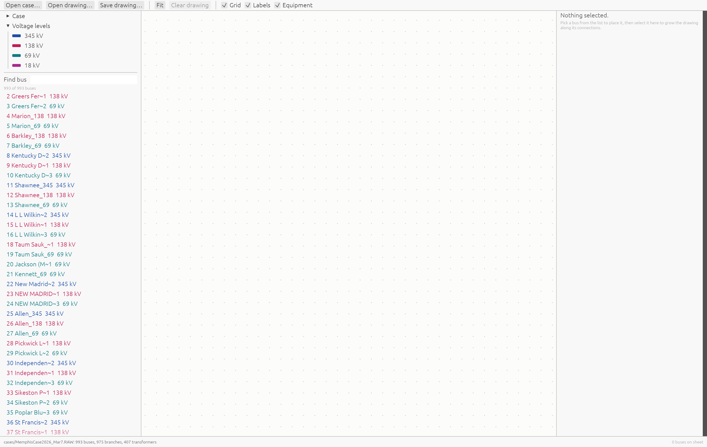
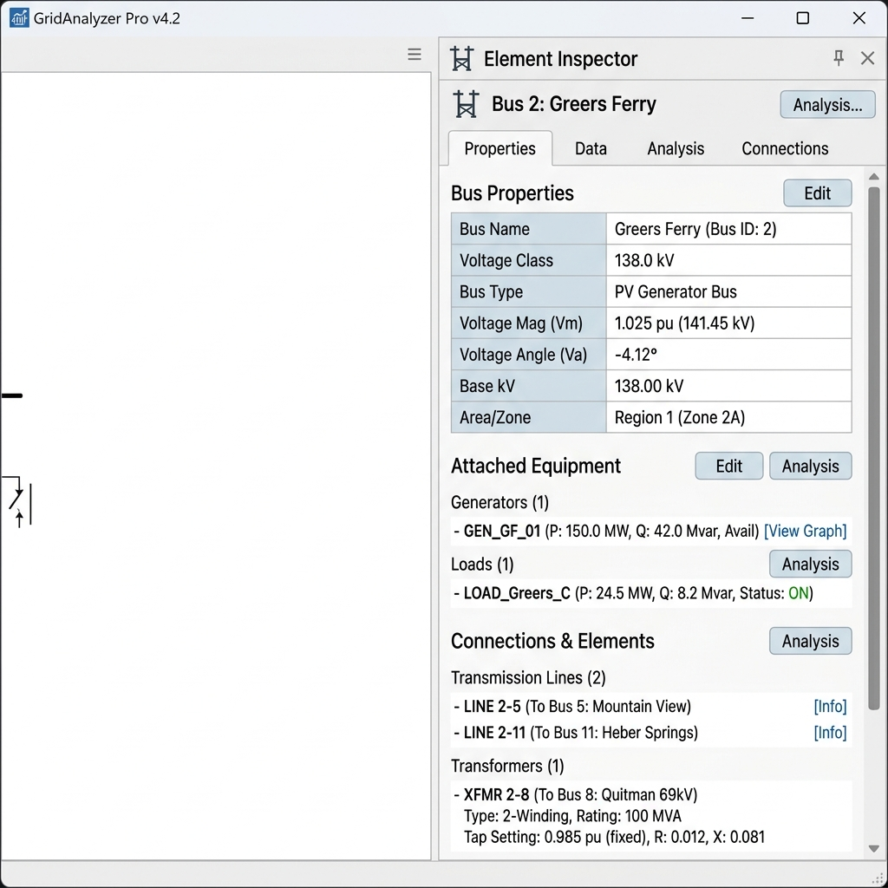

# pf-vis User Guide

Welcome to the **`pf-vis` User Guide**! `pf-vis` is an interactive desktop application for exploring electric power flow cases (Siemens PSS/E `.RAW` files) and dynamically building vector one-line diagrams.

This guide provides a walkthrough of the user interface, canvas navigation, diagram generation workflows, power flow data inspection, and file saving capabilities.

---

## 1. Interface Overview

When you launch `pf-vis` with a PSS/E case or open a saved diagram, the application presents a clean, multi-panel workspace designed for high-density engineering data:


### Workspace Panels

1. **Top Toolbar**: File management buttons (`Open case…`, `Open drawing…`, `Save drawing…`), view adjustments (`Fit`, `Clear drawing`), and display toggles (`Grid`, `Labels`, `Equipment`).
2. **Left Case Browser**: Case metadata summary, nominal voltage level legend, search filter, and list of buses present in the system.
3. **Center Canvas**: Infinite 2D grid sheet rendering grid-snapped busbars, orthogonal transmission line routing, transformer winding symbols, and attached power equipment.
4. **Right Inspector Panel**: Detailed telemetry table for the currently selected bus or branch element.
5. **Bottom Status Bar**: System status messages, dangling record notifications, and the count of buses placed on the drawing.

---

## 2. Step-by-Step Workflow

### Step 1: Loading a Power Flow Case

To open a case, click **Open case…** in the top toolbar or launch `pf-vis` from the command line specifying your `.RAW` file:

```bash
cargo run -- cases/MemphisCase2026_Mar7.RAW
```

Upon loading, the **Case Browser** populates on the left panel with case metadata (revision, base MVA, total bus/branch counts) and nominal voltage levels:



---

### Step 2: Finding & Placing Buses

Use the **Find bus** filter box in the left panel to search across the system by:
* **Bus Number**: Type `2` or `722`.
* **Bus Name**: Type `Greers` or `Marion` (case-insensitive substring match).
* **Nominal Voltage**: Type `138`, `138 kV`, or `69`.


* Click any bus in the filtered list to place it onto the center canvas sheet.
* The bus bar will snap to a grid cell near the viewport center.

---

### Step 3: Expanding the Diagram ("Growing")

Once a bus is placed on the sheet, select it on the canvas or from the bus list. The **Right Inspector Panel** will show all incident transmission lines and transformers.



1. Look under the **Connections** section in the right panel.
2. Click **Add** next to any connected line or transformer.
3. `pf-vis` automatically calculates a clear grid position for the destination bus, places it on the drawing, and routes an orthogonal transmission line or transformer symbol between them.
4. Repeat this process to expand the diagram across substations or voltage levels.

---

### Step 4: Canvas Controls & Editing

* **Pan Sheet**: Click and drag any empty space on the center canvas.
* **Zoom to Cursor**: Scroll the mouse wheel up or down. Zooming stays centered on your mouse pointer position.
* **Reposition Busbar**: Click and drag a busbar on the canvas. It snaps cleanly to grid cells as you move.
* **Resize Busbar Length**: Select a busbar on the canvas and drag the circular resize handles at either endpoint to lengthen or shorten the bar. You can also adjust the **Length** drag value in the right Inspector panel or click **Reset** to return to automatic connection-based sizing.
* **Rotate Busbar**: Select a bus and click **Rotate** in the right panel to toggle its orientation between **Horizontal** and **Vertical**.
* **Fit Camera**: Click **Fit** in the top toolbar to automatically frame all currently placed buses within view.
* **Remove Element**: Click **Remove from drawing** in the right panel to take a bus off the drawing without deleting it from the underlying PSS/E model.

---

### Step 5: Power Flow Telemetry Inspection

Selecting any component on the canvas updates the **Inspector Panel**:

* **Bus Selection**:
  * Nominal voltage & bus classification (**PV Generator**, **PQ Load**, **Swing**, **Isolated**).
  * Solved voltage magnitude ($V_m$ in per-unit) and voltage phase angle ($V_a$ in degrees).
  * Attached equipment breakdown: Generator active/reactive output ($P_g$ MW, $Q_g$ Mvar), Load demand ($P_l$ MW, $Q_l$ Mvar), and Shunt reactive power ($Mvar$).
* **Line / Branch Selection**:
  * Terminal buses, circuit identifier, per-unit impedance ($R$, $X$, $B$), MVA rating A, and in-service status.
* **Transformer Selection**:
  * 2-winding or 3-winding configuration, winding tap ratios ($windv$), nominal winding voltages, phase shift angles ($ang$), and MVA ratings.

---

### Step 6: Saving & Loading Project Drawings

Diagram layouts are independent from raw PSS/E cases, allowing you to create multiple view sheets for the same grid model.

* **Save Drawing**: Click **Save drawing…** to save a `.json` project file. The layout file stores grid coordinates, bus orientations, camera zoom, and hidden elements.
* **Open Drawing**: Click **Open drawing…** or pass the `.json` file to `pf-vis` on startup:
  ```bash
  cargo run -- cases/sample_drawing.json
  ```
  `pf-vis` automatically locates the associated `.RAW` file even if the drawing project was moved.

---

## 3. Voltage Level Color Reference

`pf-vis` uses standard color-coding for busbars and transmission lines based on nominal operating voltage:

| Voltage Class | Color Key | Hex Code |
| :--- | :--- | :--- |
| **765 kV** | Deep Rust | `#8B2F0C` |
| **500 kV** | Bright Red | `#B31B1B` |
| **345 kV** | Deep Blue | `#1C4EA8` |
| **230 kV** | Forest Green | `#1B7A3C` |
| **161 kV** | Purple | `#6A33A8` |
| **138 kV** | Magenta / Crimson | `#C01C55` |
| **115 kV** | Amber / Orange | `#A86200` |
| **69 kV** | Teal | `#0E7C86` |
| **46 kV** | Indigo | `#5B548C` |
| **34.5 kV** | Olive | `#6E741E` |
| **13.8 kV** | Charcoal | `#4A4A50` |

*Note: Any unlisted nominal voltage level dynamically inherits the color of the nearest listed voltage class using logarithmic ratio matching.*

---

## 4. Headless CLI Summary Mode

For quick audits or automated scripts, `pf-vis` can parse PSS/E files in headless mode without launching a GUI:

```bash
pf-vis --summary cases/MemphisCase2026_Mar7.RAW
```

**Output Breakdown**:
```text
cases/MemphisCase2026_Mar7.RAW
  revision 35  sbase 100 MVA  60 Hz
  buses            993
  loads            530
  fixed shunts     0
  switched shunts  61
  generators       188
  branches         975
  transformers     407 (407 two-winding, 0 three-winding)
  not read         AREA (4), OWNER (1), SYSTEM-WIDE (18), ZONE (1)
```

---

## 5. Keyboard & Mouse Quick Reference

| Action | Control / Gesture |
| :--- | :--- |
| **Pan Canvas** | Click & Drag empty canvas space |
| **Zoom Viewport** | Mouse Wheel Scroll (anchored to cursor) |
| **Select Component** | Left Click on Busbar, Branch, or Transformer |
| **Move Busbar** | Drag Busbar (snaps to grid) |
| **Auto-Fit View** | Click **Fit** button in toolbar |
| **Place New Bus** | Left Click bus name in left Case Browser |
| **Expand Connection** | Click **Add** in right Inspector panel |
